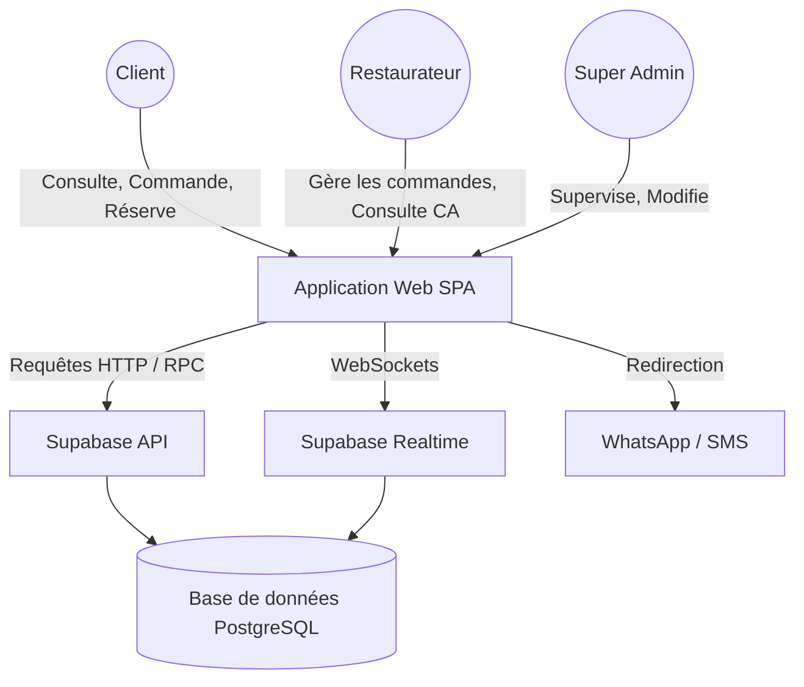
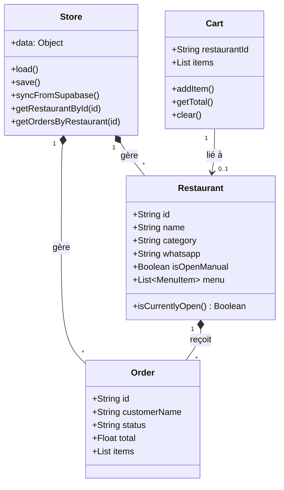

# Analyse Complète du Système d'Information : THIES Resto

Ce document présente une analyse architecturale, fonctionnelle et orientée objet de la plateforme **THIES Resto**, réalisée selon les standards de l'ingénierie logicielle.

---

## 1. Présentation générale

* **Objectif de la plateforme** : Centraliser l'offre de restauration de la ville de Thiès (Sénégal) pour faciliter la découverte de restaurants, la commande de repas (livraison/à emporter) et la réservation de tables.
* **Problématique résolue** : Fragmentation de l'information (les restaurants sont dispersés sur les réseaux sociaux), difficulté de prise de commande, absence de plateforme locale unifiée à Thiès.
* **Secteur d'activité** : FoodTech / Restauration / E-commerce local.
* **Public cible** : Habitants de Thiès, étudiants, professionnels, touristes.
* **Parties prenantes** : Clients finaux, Restaurateurs (partenaires), Équipe d'administration THIES Resto.
* **Valeur ajoutée** : 
  * Pour les clients : Un seul point d'accès pour tous les menus, commande rapide sans création de compte complexe (confirmation WhatsApp/SMS).
  * Pour les restaurateurs : Digitalisation de leur carte, tableau de bord de suivi du CA, réception de commandes en temps réel.
* **Vision métier** : Devenir le standard de la livraison et de la réservation de repas à Thiès, en s'appuyant sur des technologies légères et adaptées aux réalités locales (connexions instables, paiement en espèces, usage massif de WhatsApp).

---

## 2. Analyse du système d'information

### Acteurs et Rôles
* **Acteur Externe (Client)** : Navigue sur le catalogue, filtre les restaurants, ajoute des plats au panier, passe commande (via WhatsApp/SMS), réserve une table.
* **Acteur Interne (Restaurateur)** : Se connecte à son tableau de bord, gère son statut (Ouvert/Fermé), suit ses commandes, consulte sa comptabilité.
* **Acteur Interne (Super Admin)** : Supervise tous les restaurants, peut usurper l'identité d'un restaurant pour l'aider, gère les abonnements.

### Données et Ressources
* **Ressources manipulées** : Profils Restaurants, Plats (Menu), Commandes, Réservations, Avis clients.
* **Événements métier** : Réception d'une commande (notification push), expiration d'une période d'essai, changement de statut d'une commande (En attente -> Confirmée -> Livrée).

### Contraintes
* **Fonctionnelles** : L'application doit être ultra-rapide et fonctionner partiellement hors-ligne.
* **Techniques** : Utilisation d'un backend BaaS (Supabase) sans serveur propre.
* **Flux d'information** : 
  * Entrants : Nouvelles commandes (WebSockets), modifications de menu.
  * Sortants : Redirection vers WhatsApp avec le récapitulatif pré-rempli.

---

## 3. Analyse fonctionnelle

### Fonctionnalités principales (Core)
* **Recherche et Filtrage** : Trouver un restaurant par nom, catégorie, ou distance (géolocalisation).
* **Prise de Commande (Panier)** : Ajout de plats, calcul du total, sélection du mode (Livraison, À emporter).
* **Checkout "Social"** : Envoi de la commande via l'API WhatsApp au restaurateur.
* **Tableau de Bord Restaurateur** : Gestion des états de commandes avec notifications en temps réel.

### Fonctionnalités secondaires
* **Réservation de Table** : Formulaire de réservation avec vérification des jours de fermeture.
* **Avis Clients** : Consultation des notes.
* **Comptabilité** : Calcul du CA, filtrage par date (Aujourd'hui, Semaine, Mois).

---

## 4. Identification des objets métier

| Objet métier | Rôle | Attributs clés | Relations |
|---|---|---|---|
| **Restaurant** | Entité centrale offrant des services | `id`, `name`, `slug`, `category`, `address`, `whatsapp`, `status`, `isOpenManual` | Possède 1..* `MenuItem`, Reçoit 0..* `Order`, Reçoit 0..* `Reservation` |
| **MenuItem** | Représente un plat vendu | `id`, `name`, `description`, `price`, `image` | Appartient à 1 `Restaurant` |
| **Order** | Représente une commande | `id`, `customerName`, `customerPhone`, `mode`, `total`, `status`, `date`, `items` | Appartient à 1 `Restaurant` |
| **Reservation** | Demande de table | `id`, `customerName`, `date`, `time`, `guests`, `status` | Appartient à 1 `Restaurant` |
| **Review** | Avis client | `id`, `author`, `rating`, `comment`, `date` | Concerne 1 `Restaurant` |

---

## 5. Analyse orientée objet (OOA)

Dans l'architecture actuelle (JavaScript Vanilla), l'orienté objet n'est pas strictement appliqué (peu de classes), mais le modèle logique sous-jacent est le suivant :

* **Classes métier** : `Restaurant`, `Order`, `Reservation`, `MenuItem`.
* **Classes techniques** : `Store` (gestionnaire de persistance), `Router` (contrôleur de navigation).
* **Objets persistants** : Données synchronisées avec Supabase.
* **Objets temporaires** : Le `Cart` (panier de session), l'état des filtres (`currentOrderStatusFilter`).

### Diagramme de Classes Logique (UML)

---

## 7. Architecture applicative

L'architecture est de type **Local-First / Serverless**.

* **Front-End** : HTML5, CSS3, JavaScript Vanilla. Aucune librairie de composants (React/Vue) n'est utilisée. Le DOM est manipulé via `innerHTML`.
* **Back-End & Base de données** : **Supabase** (PostgreSQL as a Service). Gère l'API REST générée automatiquement, les WebSockets et les bases de données.
* **Couche de Persistance (Cache)** : `localStorage`. Le fichier `store.js` agit comme une base de données en mémoire tampon. Les lectures se font dans le cache pour la rapidité, et les écritures sont poussées vers Supabase.
* **Temps réel** : Utilisation de `supabase.channel('realtime-orders')` pour écouter les événements d'insertion (`INSERT`) dans la table `orders`.
* **Authentification** : Authentification personnalisée (non-standard) via des fonctions RPC PostgreSQL (`get_admin_data`, `get_restaurant_orders`). Les mots de passe sont vérifiés dans des procédures stockées.

---

## 8. Analyse des données (Modèle Logique)

Le schéma relationnel côté Supabase (PostgreSQL) se déduit des requêtes RPC et de la classe Store :

* `restaurants` (id PK, name, slug, category, address, whatsapp, is_open_manual, status, created_at)
* `menus` (id PK, restaurant_id FK, name, description, price) *(actuellement géré en JSONB dans la table restaurants)*
* `orders` (id PK, restaurant_id FK, customer_name, customer_phone, mode, total, status, items JSONB, date)
* `reservations` (id PK, restaurant_id FK, customer_name, date, time, guests, status)

> **Contraintes d'intégrité** : Un `Order` ne peut exister sans `Restaurant`. Un `MenuItem` (s'il était normalisé) ne pourrait exister sans `Restaurant`.

---

## 9. Analyse des processus métier

### Processus : Passer une commande
1. **Déclencheur** : Le client clique sur "Confirmer la commande".
2. **Acteur** : Client & Système.
3. **Actions** :
   * Le système valide les données (téléphone sénégalais requis).
   * Le système génère un ID unique (`ORD-XXXX`).
   * Le système sauvegarde la commande dans le `Store` local et l'envoie à Supabase.
   * Le système formate un message texte.
   * Le système génère un lien universel WhatsApp (`wa.me/...`).
4. **Décisions** : Si le client est hors-ligne, un lien SMS (`sms:`) est proposé en secours.
5. **Résultats** : La commande apparaît chez le restaurateur. Le client est redirigé vers WhatsApp pour finaliser la transaction humaine.

---

## 10. Analyse des flux

| Flux | Origine | Destination | Données transportées | Fréquence | Sécurité |
|---|---|---|---|---|---|
| **Synchronisation Catalogue** | Supabase | Frontend (Store) | Liste des restaurants publics | Au démarrage | Publique (Read-Only) |
| **Notification Commande** | Supabase (WebSockets) | Frontend (Dashboard) | Objet `Order` complet | À chaque commande | Protégé par canal |
| **Authentification Dashboard** | Frontend | Supabase (RPC) | ID Restaurant, Mot de passe | À la connexion | HTTPS + RPC Hash check |
| **Envoi Commande WA** | Frontend | App WhatsApp | Texte brut formaté | À chaque commande | Chiffrement WA de bout en bout |

---

## 11. Architecture orientée objet : Critique et DDD

Bien que fonctionnel, le code actuel est de nature procédurale et monolithique (le "Anti-pattern God Object" avec un fichier `app.js` de plus de 6800 lignes).

**Propositions d'amélioration selon les principes SOLID et Clean Architecture :**

1. **Single Responsibility Principle (SRP)** : 
   * Séparer le routeur (`Router`) de la logique métier.
   * Créer un `CartService` dédié à la gestion du panier.
   * Créer un `DashboardController` dédié à l'interface restaurateur.
2. **Domain Driven Design (DDD)** :
   * Définir des entités claires (Aggrégat `Order` qui contient des `OrderLines`).
   * Découpler l'infrastructure (Supabase, LocalStorage) du domaine métier (Règles de calcul de prix, heures d'ouverture).

---

## 12. Sécurité

* **Forces** : Les données sensibles des restaurants ne sont pas téléchargées par le client lambda. Les fonctions RPC (`get_restaurant_orders`) empêchent l'accès direct aux tables. L'utilisation de `DOMPurify` prévient les attaques XSS.
* **Faiblesses** : 
  * Gestion des sessions via `sessionStorage` avec mots de passe potentiellement transmis en clair dans le payload JSON de la requête RPC.
  * L'absence de JWT (JSON Web Tokens) standard Supabase Auth fragilise l'évolutivité.
* **Recommandation** : Migrer vers `Supabase Auth` (Email/Password) et utiliser les règles RLS (Row Level Security) natives de PostgreSQL au lieu de contourner via RPC.

---

## 13. Performance

* **Forces** : Le modèle "Local-First" offre une performance perçue imbattable. L'application charge quasi-instantanément et la navigation est sans latence (0 requêtes réseau au changement de page).
* **Faiblesses** : Le fichier `app.js` géant augmente le temps de téléchargement initial (Time To Interactive) et la consommation mémoire du navigateur. Les menus stockés sous forme de chaînes JSON dans le profil restaurant alourdissent les requêtes initiales.
* **Recommandation** : Mettre en place du Code Splitting (Lazy loading du Dashboard uniquement pour les restaurateurs).

---

## 14. Recommandations et Évolutions Futures

1. **Améliorations techniques urgentes (Dette technique)** :
   * **Refactoring Modulaire** : Migrer vers un bundler (Vite) ou une architecture modulaire ES6 (`import`/`export`).
   * **Normalisation de la BDD** : Séparer les Menus de la table `restaurants` pour créer une vraie table `menu_items`. Cela allégera le téléchargement initial du catalogue.
2. **Nouvelles fonctionnalités (Business)** :
   * **Espace Livreurs** : Créer un rôle "Livreur" capable de scanner un QR Code sur une commande pour l'assigner et tracer sa position GPS.
   * **Paiement Mobile** : Intégrer une API de paiement local (Wave, Orange Money) pour remplacer le paiement exclusif en espèces ou manuel via WhatsApp.

---

## 15. Conclusion Globale

Le système d'information de **THIES Resto** présente une **très bonne maturité produit** par rapport à son marché cible. Le choix d'une architecture décentralisée, s'appuyant sur WhatsApp pour pallier le manque de confiance dans les paiements en ligne et sur le cache local pour pallier les problèmes de réseau, est une excellente décision métier (Pragmatisme).

Cependant, du point de vue de l'**ingénierie logicielle**, la qualité de la conception orientée objet est faible, en raison d'un couplage fort et d'un code monolithique (procédural). Le système est actuellement très difficile à maintenir et peu extensible sans risque de régression (bugs).

**Recommandation prioritaire** : Avant d'ajouter des modules complexes (comme la gestion de flotte de coursiers), une phase de refonte architecturale logicielle (Refactoring) est impérative pour isoler les responsabilités (MVC/MVVM) et moderniser l'authentification.
