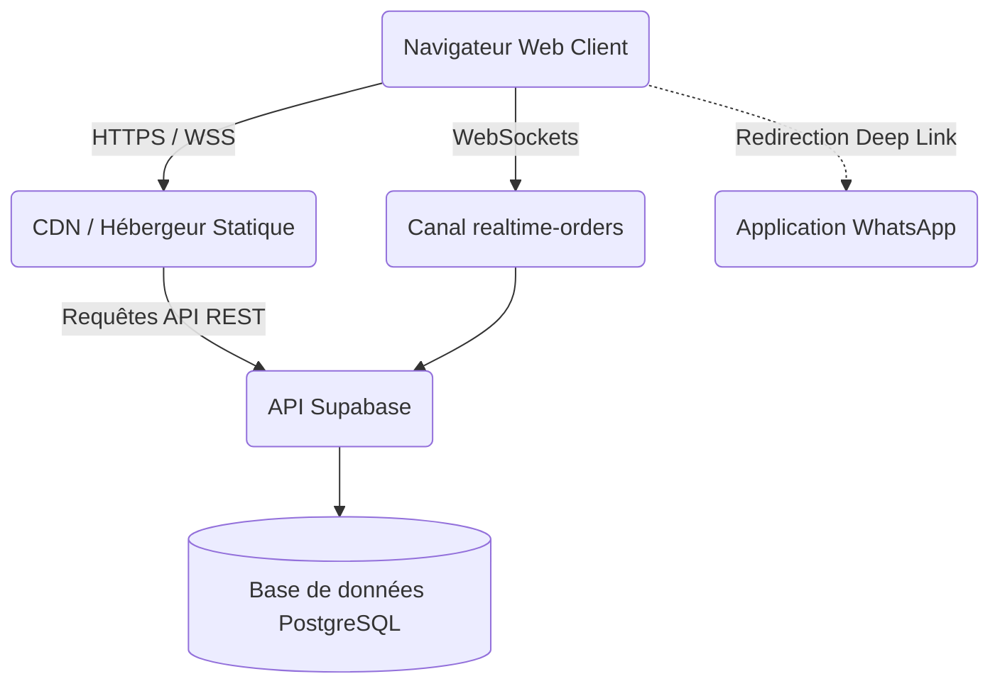
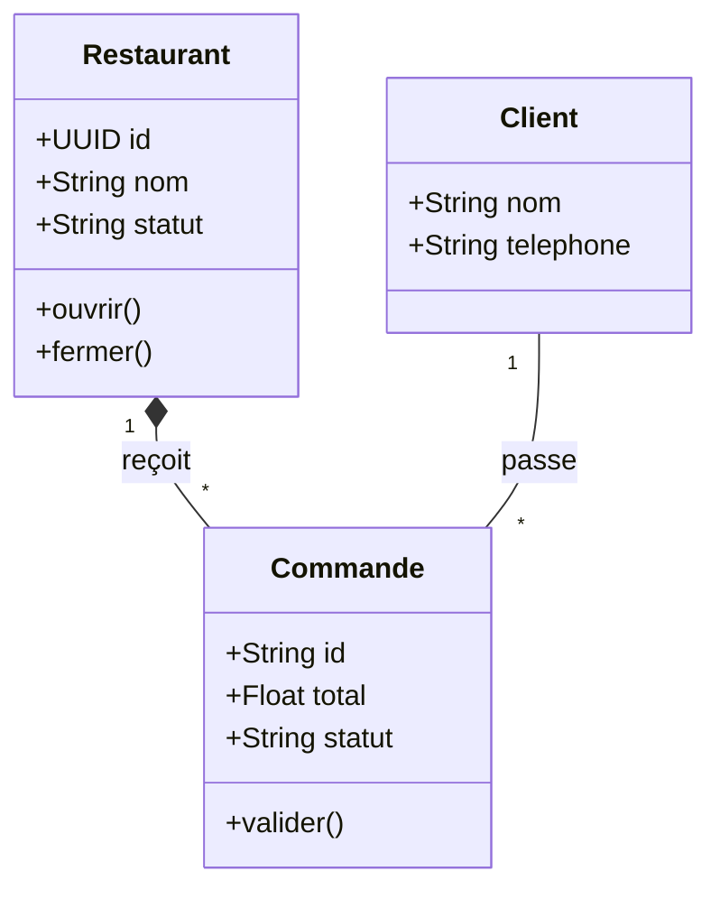

# Dossier d'Architecture et Cahier des Charges - THIES Resto

## 1. Résumé exécutif
**Vision du projet** : Devenir la plateforme numérique de référence pour la commande de repas et la réservation de tables à Thiès (Sénégal), en connectant directement les restaurateurs locaux à leurs clients via une interface fluide et adaptée au contexte technologique local (faible bande passante, usage intensif de WhatsApp).
**Contexte** : Le marché de la restauration rapide à Thiès est fragmenté. La numérisation est faible et les commandes se font souvent de manière informelle. THIES Resto digitalise ce processus.
**Objectifs stratégiques** : Accroître le chiffre d'affaires des partenaires de 30% en 6 mois, fidéliser les clients par une UX moderne, et structurer le marché local.
**Bénéfices attendus** : Visibilité accrue pour les restaurants, gain de temps pour les commandes, traçabilité comptable pour les gérants.

---

## 2. Présentation générale
* **Nom de la plateforme** : THIES Resto
* **Domaine d'activité** : FoodTech / E-commerce local.
* **Public cible** : Résidents de Thiès, étudiants, travailleurs, et restaurateurs locaux.
* **Parties prenantes** : Clients finaux, Restaurateurs (Partenaires), Administrateurs (Équipe THIES Resto).
* **Périmètre fonctionnel** : Catalogue de restaurants, gestion de panier, checkout vers WhatsApp, Dashboard restaurateur (suivi commandes, stats), Panel Super-Admin.
* **Contraintes** : Le système doit fonctionner de manière optimale sur des réseaux mobiles instables (3G/Edge) et supporter une adoption par des utilisateurs peu technophiles.

---

## 3. Étude des besoins
| ID | Catégorie | Besoin | Priorité |
|---|---|---|---|
| B-F01 | Fonctionnel | Catalogue filtrable des restaurants (Ouvert/Fermé, Catégorie) | Critique |
| B-F02 | Fonctionnel | Prise de commande avec redirection WhatsApp | Critique |
| B-F03 | Fonctionnel | Dashboard Restaurateur avec notifications temps réel | Critique |
| B-NF01 | Non-Fonctionnel | Application utilisable partiellement hors-ligne (Local-First) | Haute |
| B-NF02 | Sécurité | Protection des accès au Dashboard restaurateur | Critique |

---

## 4. Cahier des charges fonctionnel

### Fonctionnalité : F-01 Checkout Commande
* **Objectif** : Transformer un panier virtuel en commande réelle envoyée au restaurateur.
* **Acteurs** : Client.
* **Flux principal** : Le client valide son panier -> Saisit ses infos (RGPD inclus) -> Clique sur "Envoyer". Le système crée un ID de commande, l'enregistre en base, et ouvre WhatsApp pré-rempli.
* **Flux alternatif** : Si le client n'a pas WhatsApp, proposition d'envoi par SMS.
* **Critères d'acceptation** : La commande doit apparaître dans le Dashboard du restaurateur en moins de 2 secondes.

---

## 5. Cahier des charges technique
* **Architecture logicielle** : SPA (Single Page Application) modulaire.
* **Architecture Cloud** : Serverless / BaaS (Backend as a Service).
* **Technologies recommandées** : Vanilla JS (Front), Supabase / PostgreSQL (Back-end), WebSockets (Realtime).
* **Standards** : Architecture orientée événements (pour les commandes).
* **Conventions** : Séparation des responsabilités (MVC adapté).

---

## 6. Architecture globale

L'architecture est de type **Local-First** couplée à un **BaaS cloud**.



---

## 7. Modélisation UML

### Diagramme de Cas d'Utilisation
```mermaid
usecaseDiagram
    actor Client
    actor Restaurateur
    actor Admin
    
    Client --> (Consulter Catalogue)
    Client --> (Passer Commande)
    Restaurateur --> (Gérer Commandes)
    Restaurateur --> (Consulter Comptabilité)
    Admin --> (Valider Nouveaux Restaurants)
```

### Diagramme de Classes Métier


---

## 8. Modélisation des données (MCD / MLD)

**Schéma Relationnel Proposé (PostgreSQL)** :
* `restaurants` (id PK, nom, slug, adresse, telephone, categorie, open_status)
* `menu_items` (id PK, restaurant_id FK, nom, prix, categorie)
* `orders` (id PK, restaurant_id FK, customer_phone, total, status, created_at)
* `order_lines` (id PK, order_id FK, item_id FK, quantite, prix_unitaire)

*(Note : Actuellement, les menus et lignes de commandes sont en JSON. La recommandation est de normaliser la BDD selon le schéma ci-dessus).*

---

## 9. UX/UI
* **Personas** : "Amina", étudiante cherchant un repas rapide et pas cher. "Modou", gérant de fast-food cherchant à numériser ses commandes.
* **Recommandations** : Utilisation du mode sombre ("Dark Mode") pour économiser la batterie des téléphones OLED, très présents au Sénégal. Indicateurs visuels forts (Pastilles Vertes/Rouges) pour les statuts d'ouverture.

---

## 10. Sécurité
* **Authentification** : Remplacement des mots de passe en clair par **Supabase Auth** (gestion par jetons JWT).
* **Autorisation** : Mise en place stricte de politiques RLS (Row Level Security) sur PostgreSQL.
* **Protection des données** : Hachage des identifiants, anonymisation des numéros de téléphone après 90 jours (Conformité CDP Sénégal).

---

## 11. DevOps et exploitation
* **CI/CD** : Mise en place de GitHub Actions pour le déploiement automatique sur Vercel/Netlify.
* **Observabilité** : Intégration de Sentry pour capturer les erreurs front-end.
* **Environnements** : Séparation stricte entre `Staging` (test) et `Production`.

---

## 12. Plan qualité et 13. Plan de tests
* **Tests Unitaires** : Tester la classe `Store` (logique de filtrage du CA). Outil : Jest.
* **Tests Fonctionnels (E2E)** : Simuler le parcours complet (Ajout au panier -> Checkout). Outil : Cypress.
* **Critère de réussite** : 0 bug bloquant en Staging avant MEP (Mise en Production).

---

## 14. Gestion des risques
| Risque | Probabilité | Impact | Mitigation |
|---|---|---|---|
| Coupure réseau côté Restaurateur | Moyenne | Critique | Architecture Offline-first ; Notifications SMS de backup. |
| Vol de compte Restaurateur | Faible | Élevée | Implémenter Supabase Auth et OTP. |
| Baisse d'adoption client | Moyenne | Moyenne | Maintenir la friction à 0 (pas de création de compte obligatoire). |

---

## 15. Planification du projet (Roadmap)
* **Phase 1 (M1-M2)** : Refactoring modulaire de `app.js` (en cours) et sécurisation de l'Auth.
* **Phase 2 (M3-M4)** : Normalisation de la BDD et mise en place d'un espace Livreur.
* **Phase 3 (M5-M6)** : Intégration d'une API de paiement Mobile Money (Wave / Orange Money).

---

## 20. Conclusion générale
THIES Resto possède une excellente adéquation produit-marché (Product-Market Fit). Le pragmatisme technique actuel a permis de lancer rapidement. Cependant, pour passer à l'échelle (Scale), l'investissement prioritaire doit se porter sur le **remboursement de la dette technique** (refactoring) et la **sécurité des accès**. La faisabilité technique est totale, s'appuyant sur l'écosystème robuste de Supabase.
